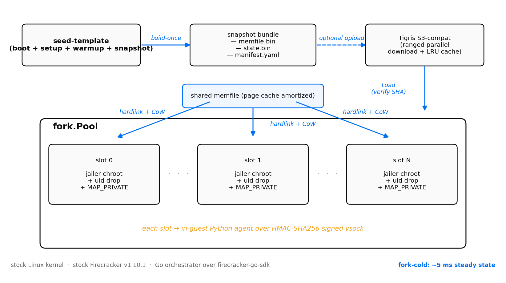
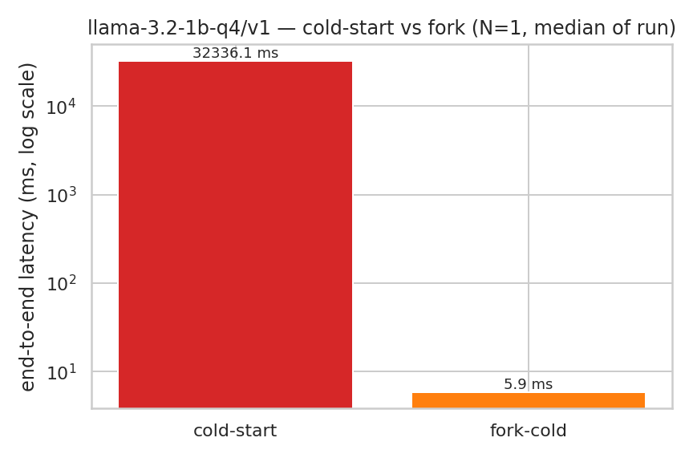
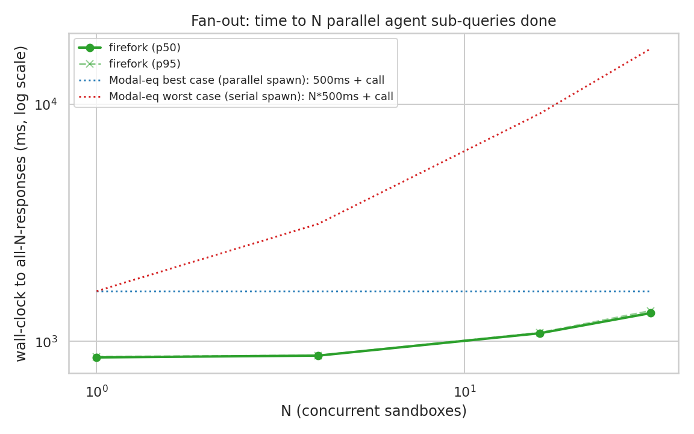

# firefork

[](https://pkg.go.dev/github.com/JustAnotherDevv/firefork-ai)
[](LICENSE)

> Memory-snapshot + copy-on-write fork primitive for Firecracker microVMs.
> Built on stock Linux + Firecracker, no custom kernel modules.

---

## What it does

Snapshot a Firecracker microVM (any state: post-boot, post-library-import, post-model-load) to a `(memfile, state)` file pair. Then **fork N copies in ~5ms each** so AI agents can:

- **Spawn fresh sandbox per user request** without paying cold-start cost
- **Roll back failed tool calls** without restarting the whole task
- **Branch into parallel exploration paths** (MCTS-style search)
- **Run N parallel sub-queries** in roughly the cost of one

---

## Architecture



```
+---------------------+  build-once  +--------------------+
| seed-template       | -----------> | snapshot bundle    |
| (boot + setup +     |              | - memfile.bin      |
|  warmup + snapshot) |              | - state.bin        |
+---------------------+              | - manifest.yaml    |
                                     +--------------------+
                                              |
                                              | optional upload
                                              v
                                     +--------------------+
                                     | Tigris S3-compat   |
                                     | (parallel ranged   |
                                     |  download + LRU)   |
                                     +--------------------+
                                              |
                                              | Load
                                              v
                          +--------------------------------------+
                          | fork.Pool                            |
                          | +--------+  +--------+  +--------+   |
                          | | slot 0 |  | slot 1 |  | slot N |   |
                          | +--------+  +--------+  +--------+   |
                          |   each:                              |
                          |   - per-fork jailer chroot (uid drop)|
                          |   - MAP_PRIVATE on shared memfile    |
                          |   - HMAC-signed vsock to in-guest    |
                          |     Python agent                     |
                          +--------------------------------------+
```

Stock kernel, stock Firecracker, Go orchestrator over [`firecracker-go-sdk`](https://github.com/firecracker-microvm/firecracker-go-sdk). Forks share the parent memfile via per-chroot hardlink + `MAP_PRIVATE` mmap so the kernel handles copy-on-write transparently. Jailer chroots provide per-fork filesystem isolation + uid drop to a non-privileged `firefork-jail` user.

Full design: [docs/architecture/](./docs/architecture/) (ADRs).

---

## Performance

> **Llama-3.2-1B-Q4 inference sandbox: 32-second cold start to 6-millisecond fork. 5,510x faster.**
>
> **32 parallel AI-agent sub-queries in 1.3 seconds — same time as one LLM API call. A serial-spawn baseline would pay 17 seconds for the same workload.**



### Cold-start vs fork across 4 templates

| Template | Cold-start | Fork-cold | **Speedup** |
|---|---:|---:|---:|
| alpine-base | 4.72 s | 5.09 ms | **927x** |
| python (numpy) | 4.44 s | 5.33 ms | **833x** |
| python-sci (pandas + sklearn) | 5.10 s | 5.54 ms | **920x** |
| **llama-3.2-1b-q4** | **32.34 s** | **5.87 ms** | **5,510x** |

Numbers: median e2e_ms across 10 trials at N=1, jailed (per-fork chroot, uid drop). Measured on a single Multipass Ubuntu 24.04 VM (4 vCPU, 4 GiB RAM, nested KVM via Hyper-V) on an Intel i5-11400 Windows 10 Pro host.

### Fan-out: N parallel agent sub-queries

Each fork dispatches a simulated 800ms LLM call (`sleep 800ms; echo ok` via vsock-agent exec). Bench at N=1, 4, 16, 32.



| N parallel sandboxes | firefork (p50) | parallel-spawn baseline | serial-spawn baseline | Speedup vs serial |
|---:|---:|---:|---:|---:|
| 1 | 856 ms | 1.3 s | 1.3 s | 1.5x |
| 4 | 871 ms | 1.3 s | 2.8 s | 3.2x |
| 16 | 1.08 s | 1.3 s | 8.8 s | **8.1x** |
| 32 | 1.32 s | 1.3 s | 16.8 s | **12.7x** |

Baselines assume 500ms cold spawn + 800ms LLM call. Real-world serverless platforms sit between parallel-best and serial-worst depending on quota and region warmth.

---

## Reproduce the numbers

```sh
# Linux host with /dev/kvm + Firecracker v1.10.1 + Go 1.23+:
git clone https://github.com/JustAnotherDevv/firefork-ai && cd firefork-ai
make setup-jailer                            # creates firefork-jail uid 10000

# Build templates (~3-30s each):
for cfg in alpine python python_sci node shell_tools chrome_headless llama llm_client; do
  sudo -E bin/seed-template --config configs/template_${cfg}.yaml --jailer /usr/local/bin/jailer
done

# Cold vs fork benchmark:
for tpl in alpine-base python python-sci llama-3.2-1b-q4; do
  sudo -E bin/bench --template $tpl/v1 \
    --def-path configs/template_${tpl//-/_}.yaml \
    --jailer /usr/local/bin/jailer \
    --modes cold-start,fork-cold --N 1,4,16 --runs 10 --cold-runs 3 \
    --out results/$tpl.csv
done

# Fan-out concurrency benchmark:
sudo -E bin/bench --template llm-client/v1 \
  --def-path configs/template_llm_client.yaml \
  --jailer /usr/local/bin/jailer \
  --mode fan-out --N 1,4,16,32 --runs 5 --sim-delay-ms 800 \
  --out results/fanout.csv

# Plots:
python3 notebooks/analyze.py results/*.csv
python3 notebooks/analyze_fanout.py results/fanout.csv
```

---

## Repo layout

```
cmd/
  firefork/         # orchestrator + boot CLI
  seed-template/    # build template VMs + snapshot
  fork/             # one-shot fork CLI (per-template fork-N)
  bench/            # cold-start vs fork + fan-out benchmark
  firefork-server/  # HTTP API over the fork pool
internal/
  fc/               # firecracker-go-sdk wrapper + jailer
  template/         # template builder + registry + ParseKey
  snapshot/         # store, compress, manifest, LRU cache
  fork/             # CoW fork pool + warm-pool + sweep
  workload/         # in-guest vsock IPC with HMAC auth
  storage/          # Tigris/S3 via aws transfermanager
  cliutil/          # shared 0o700 dir helper
docs/
  architecture/     # ADRs (decisions + alternatives)
  runbooks/         # deploy, troubleshoot, rotate-secrets
  api/              # OpenAPI 3.1 spec for firefork-server
examples/
  basic-fork/       # in-tree Go consumer of fork.Pool
  http-client/{go,python}/  # HTTP client demos
  mcts-branching/   # fan-out N showcase
images/             # rootfs + kernel build scripts
configs/            # template YAMLs (alpine, python, python-sci, node, shell-tools, chrome-headless, llama, llm-client)
notebooks/          # benchmark analysis (Python)
results/            # CSVs + PNGs
scripts/            # setup-jailer.sh + diag-jailer.sh + rootfs builders
```

---

## HTTP API

`firefork-server` exposes the primitive over HTTP for non-Go clients. Same pool, same numbers, JSON in/out.

```sh
# Start (default :8080; jailer optional):
sudo -E firefork-server \
  --jailer /usr/local/bin/jailer \
  --registry /var/lib/firefork/registry/templates.json &

# Auth: set FIREFORK_AUTH_TOKEN before exposing to anything but localhost.
# Without it the server logs a DEMO MODE warning and accepts every request.

# Spawn 4 forks of the llama template:
curl -s localhost:8080/v1/fork \
  -H 'Content-Type: application/json' \
  -d '{"template":"llama-3.2-1b-q4/v1","count":4}' | jq

# Run a command inside one of them:
curl -s localhost:8080/v1/exec \
  -H 'Content-Type: application/json' \
  -d '{"fork_id":"<id from /v1/fork>","cmd":"echo hello from guest"}' | jq

# Release one when done:
curl -X DELETE localhost:8080/v1/forks/<id>

# Inspect:
curl -s localhost:8080/v1/forks    # live forks
curl -s localhost:8080/v1/templates # registry
curl -s localhost:8080/v1/metrics  # pool + warm-pool counters
curl -s localhost:8080/healthz     # liveness (no auth)
```

The server is a thin wrapper over `internal/fork.Pool` + `internal/workload.Call`. Same code path the CLI uses; HTTP adds sub-ms over raw `Pool.Fork`.

---

## Hardware requirements

Linux + `/dev/kvm`. Firecracker doesn't run on macOS or Windows directly. Tested on:
- Bare-metal Linux
- GCP `n2-standard-4` with nested virt
- Local Multipass + Hyper-V (Windows 10 Pro host)

---

## License

MIT (see LICENSE).
